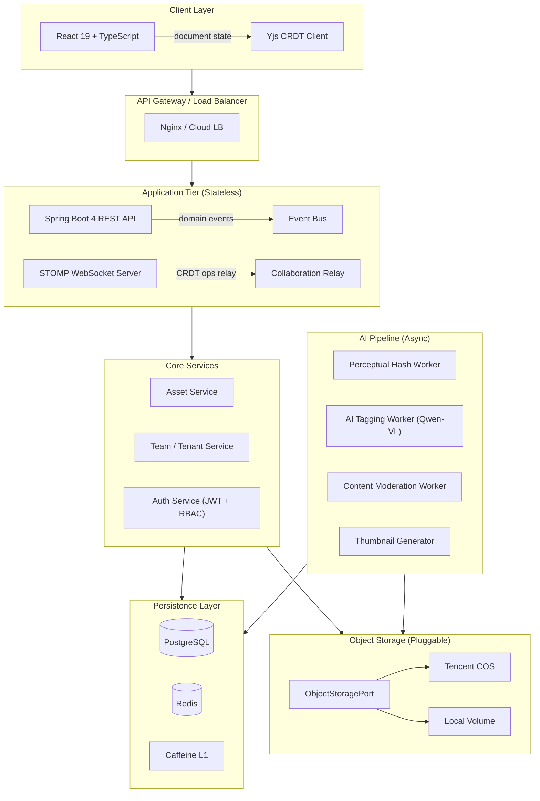
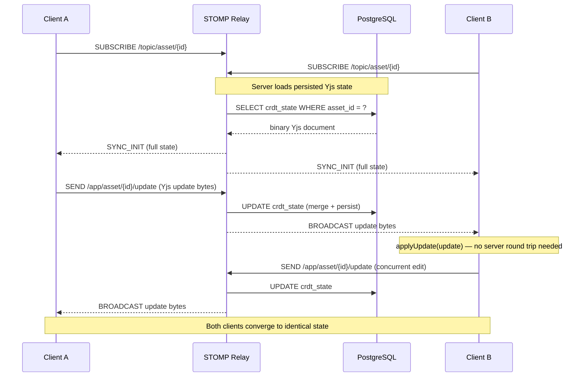
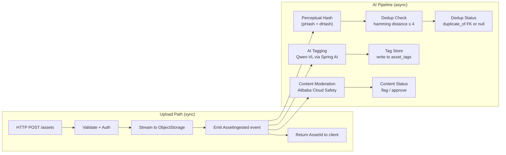
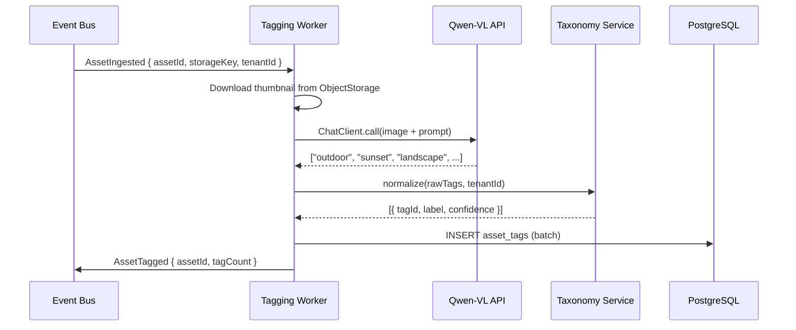
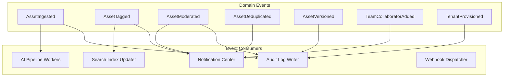
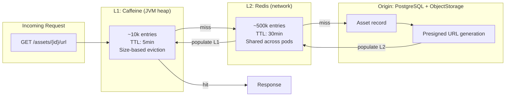
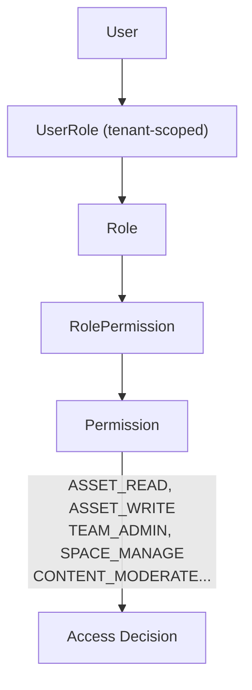
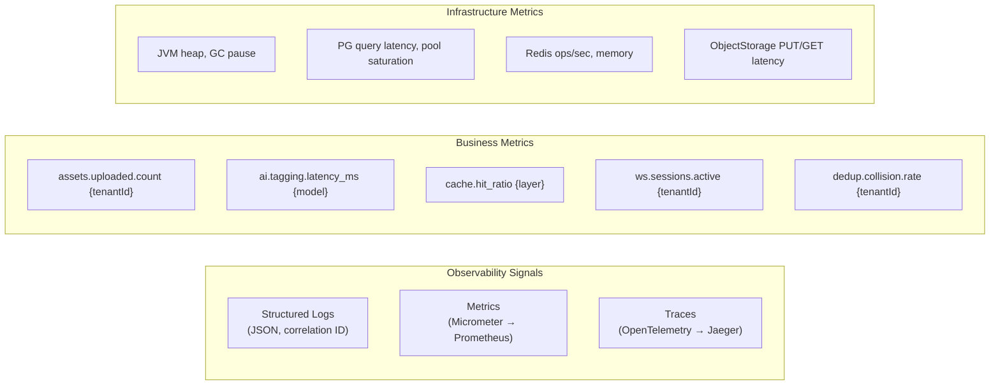

# Collaborative Cloud Picture Platform — Architecture

> *A document for engineers who care about why, not just what.*

---

## Table of Contents

1. [Product Vision](#product-vision)
2. [Design Philosophy](#design-philosophy)
3. [Core Architecture Pillars](#core-architecture-pillars)
4. [System Narrative](#system-narrative)
5. [Architecture Overview](#architecture-overview)
6. [Realtime Collaboration Model](#realtime-collaboration-model)
7. [AI Pipeline](#ai-pipeline)
8. [Event Flow](#event-flow)
9. [Consistency Model](#consistency-model)
10. [Storage Layer](#storage-layer)
11. [Cache Strategy](#cache-strategy)
12. [Security Model](#security-model)
13. [Observability](#observability)
14. [Future Roadmap](#future-roadmap)
15. [Non-Goals](#non-goals)
16. [Trade-offs](#trade-offs)

---

## Product Vision

Most collaborative asset platforms are feature-accumulation projects — they grow by bolting on capabilities until the architecture collapses under its own surface area. This platform is designed differently: as a small number of deeply considered primitives that compose cleanly.

The core insight is that a cloud picture platform is, at its heart, a **distributed state synchronization problem** with a media delivery layer on top. Every design decision flows from that framing.

Teams upload, annotate, version, and curate visual assets together — across time zones, network conditions, and organizational boundaries. The system must make conflict-free concurrency feel natural, AI-assisted enrichment feel invisible, and multi-tenant isolation feel effortless.

This is not a file hosting service with a collaboration layer bolted on. It is a collaboration-first system with a carefully designed media backend beneath it.

---

## Design Philosophy

### 1. Local-First, Server-Confirmed

Collaboration state is owned locally and synchronized remotely. The client is not a thin view over server data — it is a full participant in the CRDT merge protocol. The server acts as a persistence and relay layer, not an authority on what the document currently looks like.

This matters because: latency is physics. If every cursor move, tag edit, or annotation change requires a round trip, collaboration feels like working through a proxy. It should feel like working in the same room.

### 2. Explicit Over Implicit

Every system boundary is explicit. Storage providers implement a named interface. Cache layers have defined eviction contracts. AI pipeline stages emit typed events. Nothing is ambient. This makes the system predictable under failure and straightforward to evolve.

### 3. Isolation Without Ceremony

Multi-tenant isolation should not require per-request ritual. Tenant context is propagated through a scoped execution context, not threaded manually through every function signature. The isolation model is enforced at the persistence layer boundary, not sprinkled across business logic.

### 4. AI as Infrastructure, Not Feature

AI tagging, captioning, and deduplication are not user-facing features with toggle switches. They are pipeline stages that run unconditionally on every ingested asset. The user sees the output — accurate tags, deduplicated results, content policy signals — without needing to invoke them explicitly. AI is part of the ingest contract.

### 5. Stateless Edge, Stateful Core

The HTTP tier is stateless. JWTs carry identity. Redis carries session-adjacent state. PostgreSQL carries durable state. Nothing that matters lives in the application process. This makes horizontal scaling a deployment decision, not an architectural one.

---

## Core Architecture Pillars

| Pillar | Implementation | Why |
|---|---|---|
| **Collaboration Consistency** | Yjs CRDT + STOMP/WebSocket relay | Convergence without coordination |
| **Media Delivery** | Two-level cache (Caffeine → Redis) + CDN-aware URL generation | Sub-millisecond hot reads, cost-efficient cold reads |
| **AI Enrichment** | Async pipeline with typed event bus | Non-blocking ingest, retryable stages |
| **Storage Abstraction** | `ObjectStoragePort` interface + COS/local adapters | Zero-cost storage backend migrations |
| **Tenant Isolation** | Row-level tenantId + schema-per-tier option | Predictable data boundaries |
| **Observability** | Structured logs + Micrometer traces + custom business metrics | Root cause in minutes, not hours |

---

## System Narrative

When an engineer at a creative agency uploads a batch of campaign assets at 11 PM before a deadline, several things happen simultaneously and invisibly.

The upload is received by a stateless API pod, which validates the JWT, resolves tenant context from the token claims, and streams the binary to the configured object storage backend — either Tencent COS or a local volume, depending on deployment tier. The upload API does not wait for AI processing. It responds with the asset ID the moment storage durability is confirmed.

Simultaneously, an `AssetIngested` domain event is published to the internal event bus. This event is the handoff point between the synchronous upload path and the asynchronous enrichment pipeline. The pipeline stages — perceptual hashing, AI tagging via Qwen-VL, content moderation, thumbnail generation — execute independently, in parallel where dependencies allow, and emit their own events on completion.

By the time the engineer's colleague opens the asset browser the next morning, the assets are fully tagged, deduplicated against the team's existing library, and have passed content policy checks. No one pressed a "process" button. No one waited at a spinner.

Meanwhile, if two team members are co-editing an asset's metadata — its title, tags, assigned categories — their Yjs clients are exchanging CRDT operations through a STOMP relay. Conflicts are mathematically impossible, not just unlikely. The last-write-wins semantics of naive locking are replaced by a merge function that is commutative, associative, and idempotent. The server stores the serialized Yjs document state and replays it to reconnecting clients.

This is what "infrastructure-grade" means: the complexity is absorbed by the system, not delegated to the user.

---

## Architecture Overview



---

## Realtime Collaboration Model

### Why CRDT, Not OT

Operational Transformation (OT) requires a central server to maintain a canonical operation order. That server becomes a coordination bottleneck and a single point of failure for collaboration. CRDTs (Conflict-free Replicated Data Types) do not require coordination — any two clients can merge their states independently and arrive at the same result.

For an asset metadata editor — tags, descriptions, annotations, category assignments — the Yjs document model maps cleanly. Each field is a shared type. Concurrent edits to different fields never conflict. Concurrent edits to the same field use last-write-wins semantics at the character level, which is the correct behavior for freeform text.

### WebSocket Synchronization Flow



### Awareness Protocol

Cursor positions, presence indicators, and selection highlights are ephemeral — they must not be persisted to the database. These are transmitted as Yjs Awareness updates over the same STOMP connection but routed to an in-memory awareness store in Redis (TTL: 30s). This keeps the collaboration feel smooth without polluting the durable document state.

---

## AI Pipeline

### Ingest Contract

Every asset passing through the upload endpoint unconditionally triggers the AI pipeline. There is no opt-in. This is intentional: tags, deduplication signals, and content policy decisions should be properties of every asset in the system, not optional metadata for well-behaved clients.



### AI Tagging Architecture

The tagging worker uses Spring AI's `ChatClient` abstraction targeting Qwen-VL. Images are passed as base64-encoded content within a structured prompt that requests a JSON array of tags with confidence scores. The worker normalizes tags against the tenant's taxonomy before writing, enabling per-tenant tag vocabularies without changing the pipeline code.



### Perceptual Hash Deduplication

pHash operates on the luminance channel of a normalized 32×32 grayscale thumbnail. The resulting 64-bit hash is stored alongside the asset record. On ingest, a nearest-neighbor query against existing hashes (Hamming distance ≤ 4) identifies perceptual duplicates within the tenant's asset library. This catches re-encoded JPEGs, resized versions, and minor crops — not just byte-identical files.

---

## Event Flow



The event bus is an in-process Spring ApplicationEvent bus for single-node deployments, with an interface abstraction (`DomainEventPublisher`) that allows drop-in replacement with Kafka or RabbitMQ for distributed deployments. This is a deliberate scaling seam — the same domain logic runs in a monolith or a distributed system without code changes.

---

## Consistency Model

### Strong vs. Eventual — A Deliberate Choice

| Operation | Consistency Model | Rationale |
|---|---|---|
| Asset upload | Strong (sync DB write) | Upload must be durable before client receives ACK |
| AI tag writes | Eventual (async pipeline) | Tags are enrichment; slight delay is acceptable |
| CRDT metadata edits | Convergent (Yjs merge) | Conflicts are mathematically resolved, not avoided |
| Tenant provisioning | Strong (transactional) | Partial tenant state is dangerous |
| Cache reads | Eventual (TTL-bounded) | Stale-while-revalidate is acceptable for media URLs |
| Presence/awareness | Ephemeral (Redis TTL) | Loss on network partition is acceptable |

The system does not chase global strong consistency. It chooses the consistency level appropriate to each operation's failure semantics, and is explicit about those choices in the data model and API contracts.

---

## Storage Layer

### The `ObjectStoragePort` Interface

```java
public interface ObjectStoragePort {
    PutResult put(String key, InputStream data, long contentLength, String contentType);
    GetResult get(String key);
    URL presignedGet(String key, Duration ttl);
    void delete(String key);
    boolean exists(String key);
}
```

Two adapters exist: `CosObjectStorageAdapter` (Tencent Cloud Object Storage) and `LocalFileObjectStorageAdapter` (filesystem-backed, for development and self-hosted deployments). The active adapter is resolved at startup via Spring's `@ConditionalOnProperty`. No application code references a concrete storage implementation.

### Why This Matters

Storage backends change. S3 pricing changes. Vendors change. A system that has COS-specific SDK calls distributed across its codebase pays a high migration tax. The port abstraction makes storage a configuration decision: swap the adapter, update the properties, redeploy. The business logic is unchanged.

### Storage Key Convention

```
{tenantId}/{year}/{month}/{assetId}/{variant}

Example:
t_4f2a/2025/01/a_8c3d1/original.jpg
t_4f2a/2025/01/a_8c3d1/thumb_400w.webp
t_4f2a/2025/01/a_8c3d1/thumb_800w.webp
```

Tenant-prefixed keys provide storage-level isolation and enable per-tenant cost attribution without database queries.

---

## Cache Strategy

### Two-Level Cache Architecture



### Cache Flow Decision Rules

**L1 (Caffeine):** Hot assets — the top ~5% of assets by access frequency, determined by access count tracked in Redis. JVM-local cache eliminates Redis RTT (~1ms) for the most common reads. Evicted when the JVM heap pressure threshold is reached.

**L2 (Redis):** Warm assets — presigned URLs with TTL aligned to the URL's expiry minus a safety margin. Shared across all application pods, so a cache warm from pod A is immediately available to pod B.

**Cache Invalidation:** On asset deletion or version update, both L1 and L2 entries are invalidated synchronously. Presigned URL TTLs are intentionally short (15 minutes) to make the invalidation window narrow.

**Write Strategy:** Write-around. Cache is populated on read, not on write. Newly uploaded assets do not pre-warm the cache — the first access triggers population. This avoids cache churn on batch uploads.

---

## Security Model

### JWT Structure

```json
{
  "sub": "user_9f3a",
  "tenantId": "t_4f2a",
  "roles": ["ASSET_EDITOR", "TEAM_VIEWER"],
  "spaceIds": ["sp_a1", "sp_b7"],
  "iat": 1704067200,
  "exp": 1704153600
}
```

JWTs carry tenant context and RBAC roles. No database query is needed to determine authorization context — the token is the context. This makes the stateless API tier possible: any pod can process any request without shared session state.

### RBAC Model



Permissions are checked at the service layer, not the controller layer. Controllers perform authentication (valid JWT). Services perform authorization (does this identity hold the required permission in this tenant context). This keeps authorization logic co-located with business logic, not scattered across HTTP routing.

### Multi-Tenant Isolation

Row-level isolation via `tenantId` on every tenant-scoped table, enforced by a Hibernate filter activated on every session. The filter cannot be disabled from application code — it is activated in a `@Component` that intercepts session creation.

For enterprise tenants requiring schema-level isolation (regulatory requirements, data residency), a schema-per-tenant mode is available via a routing `DataSource` that selects the target schema from the resolved tenant context.

---

## Observability

### What We Measure

Observability is not logging. Logs record events. Metrics record rates. Traces record causality. All three are required to answer: *why did the P95 latency spike for tenant X at 14:32?*



### Correlation IDs

Every inbound HTTP request receives a `X-Request-ID` header (generated if absent). Every async event carries a `correlationId` field derived from the originating request. Every log line includes both. This makes it possible to trace a single upload request through the synchronous API response and across every async pipeline stage that follows.

### SLO Targets

| Operation | P50 | P95 | P99 |
|---|---|---|---|
| Asset URL fetch (L1 hit) | < 2ms | < 5ms | < 10ms |
| Asset URL fetch (L2 hit) | < 10ms | < 25ms | < 50ms |
| Asset upload acknowledgment | < 200ms | < 800ms | < 2000ms |
| CRDT operation relay | < 50ms | < 150ms | < 500ms |
| AI tagging (async) | < 3s | < 10s | < 30s |

---

## Future Roadmap

### Near Term

- **Asset versioning with diff visualization** — Track binary deltas between versions using content-addressed storage. Show perceptual diffs for image assets.
- **Webhook delivery with at-least-once guarantees** — Persistent outbox table with exponential backoff retry. Dead-letter queue for failed deliveries.
- **Full-text search** — Integrate Elasticsearch or PostgreSQL `tsvector` for tag + description search within tenant scope.

### Medium Term

- **Pluggable event bus** — Formalize the `DomainEventPublisher` interface with a Kafka adapter for deployments requiring cross-service event streaming.
- **AI model routing** — Route tagging requests to different models (Qwen-VL, GPT-4o-Vision, Gemini) based on tenant tier or content type, without changing the pipeline contract.
- **Edge presigned URLs** — CDN integration where presigned URL generation produces CDN-signed tokens, enabling edge caching of authenticated asset delivery.

### Long Term

- **Federated collaboration** — Allow cross-tenant asset sharing via a capability-based link model, with explicit grant scoping and audit trail.
- **WASM-accelerated CRDT** — Compile Yjs merge functions to WASM for server-side CRDT operations, reducing GC pressure in the relay tier.
- **Differential sync** — Replace full Yjs state snapshots on reconnect with a vector-clock-based differential sync, reducing reconnection payload for large documents.

---

## Non-Goals

This architecture explicitly does not address:

- **Video or audio processing** — The pipeline is designed for still images. Video ingest, transcoding, and streaming are out of scope and would require a separate media processing tier.
- **Public CDN hosting** — Presigned URLs provide time-bounded authenticated access. Anonymous public CDN delivery is not a design target. Teams needing public asset hosting should use a separate CDN layer outside this system.
- **Branching or merge workflows** — Asset versioning is linear. Git-style branching of asset metadata trees is not modeled. The CRDT collaboration model handles concurrency within a single version.
- **Cross-region replication** — The storage abstraction supports plugging in a multi-region-capable backend (e.g., COS with cross-region replication enabled), but the application layer does not implement region-aware routing or conflict resolution across region replicas.
- **Real-time image annotation drawing** — Yjs-backed text metadata editing is in scope. Pixel-level collaborative drawing on images (Figma-style canvas) is not.

---

## Trade-offs

### Chosen: In-Process Event Bus over Kafka (default)

**Upside:** Zero infrastructure dependency for single-server deployments. No consumer group lag. No schema registry. No broker availability dependency on the upload path.

**Downside:** Events are lost if the process crashes between publish and consumer execution. Acceptable because the AI pipeline is idempotent — a re-processed asset produces the same tags — and assets can be manually requeued via an admin endpoint.

**Migration path:** The `DomainEventPublisher` interface is the escape hatch. When event volume or durability requirements exceed in-process capabilities, swap the implementation. No business logic changes.

---

### Chosen: JWT over Server Sessions

**Upside:** Stateless pods. Horizontal scaling without sticky sessions. Token carries tenant context, eliminating per-request DB lookups for identity resolution.

**Downside:** Token revocation requires either short expiry (frequent re-auth) or a revocation list (adds a Redis lookup to every request, partially defeating the stateless benefit). Current implementation uses 24-hour expiry with a Redis-backed revocation set checked only on sensitive operations (team admin actions, billing changes).

---

### Chosen: Yjs over Phoenix Channels / ShareDB

**Upside:** Yjs is a mature, battle-tested CRDT library with strong TypeScript support, offline resilience, and a rich ecosystem of shared type implementations (Y.Map, Y.Array, Y.Text).

**Downside:** The Yjs document model is binary and opaque — inspecting document state requires deserializing the Yjs encoding, which adds operational complexity. Server-side CRDT operations require a Java Yjs port (y-crdt via JNI or a re-implementation), which is non-trivial.

**Current resolution:** The STOMP relay treats Yjs update bytes as opaque blobs. Server-side merging is handled by maintaining the full Y.Doc state, serialized to PostgreSQL as a `bytea` column, and applying incoming updates using the Yjs binary protocol. A lightweight Java WASM runtime (GraalVM Polyglot) executes the Yjs JavaScript merge function server-side.

---

### Chosen: Row-Level Tenant Isolation over Database-Per-Tenant

**Upside:** Operationally simple. One connection pool, one migration path, one schema version. Suitable for the majority of tenants.

**Downside:** A misconfigured Hibernate filter could expose cross-tenant data. The risk is mitigated by integration tests that assert tenant isolation on every query that touches tenant-scoped tables, and by the schema-per-tenant option available for enterprise tiers.

---

*This document reflects the architecture as designed and implemented. Sections marked "Future Roadmap" represent intended directions, not commitments. Trade-offs sections represent the current best judgment — they should be revisited as the system evolves and operational experience accumulates.*

---

<sub>Generated for engineering audiences. Intended for rendering as a technical reference site or internal engineering wiki. Last reviewed: 2025.</sub>
