# SCM Platform Architecture Review

**Review Date:** 2026-06-10
**Reviewers:** Principal Engineering Architecture Committee
**Business Context:** B2B2C Marketplace (Suppliers, Distributors, Consumers)
**Scale:** Growth Stage (10K-100K orders/day)
**Focus Areas:** Performance, Architecture, Security, DevOps, Maintainability

---

## 1. Architecture Scorecard

### Overall Assessment: **7.2/10** (Strong Foundation, Growth-Ready)

| Dimension | Score | Rating | Notes |
|-----------|-------|--------|-------|
| **Modularity** | 8/10 | Strong | Clean domain boundaries, api/service split, well-defined modules |
| **Scalability** | 7/10 | Good | Redis hot path, read-write separation, but database bottlenecks remain |
| **Reliability** | 7/10 | Good | Seata transactions, circuit breakers, but missing chaos engineering |
| **Security** | 8/10 | Strong | Multi-layer auth, WebAuthn, MFA, audit logging, but SSRF gaps |
| **Observability** | 7/10 | Good | Prometheus/Grafana/SkyWalking, but missing SLOs and alerting rules |
| **Testability** | 6/10 | Adequate | Good unit tests, integration tests, but no coverage thresholds or mutation testing |
| **Operability** | 6/10 | Adequate | Docker Compose dev env, but placeholder deploy jobs, no runbooks |
| **Data Architecture** | 8/10 | Strong | Partitioning, tenant isolation, CQRS, but migration tooling missing |
| **API Design** | 7/10 | Good | REST + Dubbo, versioning, but no contract testing |
| **Performance** | 7/10 | Good | Redis Lua scripts, two-level cache, but N+1 query risks |

### Strengths (What's Done Well)

1. **Multi-tenant isolation is defense-in-depth**: `@DS` routing + `TenantInterceptor` SQL injection + `TenantAwareEntity` base class
2. **Inventory hot path is properly optimized**: Redis Lua scripts, never query PostgreSQL in hot path
3. **Distributed transaction strategy is pragmatic**: AT mode for simple ops, TCC for inventory (critical path)
4. **Security is enterprise-grade**: JWT + OAuth2 + WebAuthn + TOTP MFA + API signatures + SQL injection filter
5. **CQRS pattern is correctly applied**: Cross-database operations properly separated into query/command services
6. **Database design is mature**: Partitioning, JSONB for flexible schema, comprehensive indexing strategy

### Weaknesses (Critical Gaps)

1. **No contract testing**: Inter-service API contracts are not verified
2. **Placeholder deployment**: CI/CD pipeline has TODO comments for deploy jobs
3. **No coverage thresholds**: JaCoCo runs but doesn't enforce minimums
4. **SonarCloud/OWASP are non-blocking**: Quality gates use `continue-on-error: true`
5. **No chaos engineering**: No resilience testing or fault injection
6. **Missing SSRF protection**: No explicit filter for outbound requests

---

## 2. Technical Debt Report

### Critical Debt (Must Fix Before Scale)

| ID | Debt Item | Impact | Effort | Priority |
|----|-----------|--------|--------|----------|
| TD-01 | **No database migration tool**: Manual SQL scripts, no Flyway/Liquibase | Schema drift risk, rollback difficulty | 2 weeks | P0 |
| TD-02 | **Overlapping CI workflows**: `maven-build.yml` and `ci.yml` both trigger on same events | Confusion, wasted CI minutes, inconsistent results | 1 week | P0 |
| TD-03 | **Placeholder deploy jobs**: `deploy-dev` and `deploy-prod` have TODO comments | No automated deployment, manual release process | 2 weeks | P0 |
| TD-04 | **No coverage thresholds**: JaCoCo has no minimum enforcement | Coverage can degrade without detection | 2 days | P0 |
| TD-05 | **SonarCloud/OWASP non-blocking**: `continue-on-error: true` | Quality issues can merge to main | 1 day | P0 |

### High Debt (Should Fix Within 60 Days)

| ID | Debt Item | Impact | Effort | Priority |
|----|-----------|--------|--------|----------|
| TD-06 | **No contract testing**: No Pact/Spring Cloud Contract | API breaking changes not caught until runtime | 2 weeks | P1 |
| TD-07 | **No mutation testing**: No PIT/PiTest | Test quality not verified | 1 week | P1 |
| TD-08 | **No E2E tests**: No Cypress/Playwright for frontend | UI regressions not caught | 2 weeks | P1 |
| TD-09 | **No runbooks**: No operational runbooks for incidents | Slow incident response, tribal knowledge | 2 weeks | P1 |
| TD-10 | **No database backup strategy**: No automated backup scripts | Data loss risk | 1 week | P1 |
| TD-11 | **Missing `X-Content-Type-Options` header**: Disabled by default | MIME sniffing attacks possible | 1 day | P1 |
| TD-12 | **CORS `allowedHeaders: *`**: Permissive header configuration | Potential header injection | 1 day | P1 |

### Medium Debt (Should Fix Within 180 Days)

| ID | Debt Item | Impact | Effort | Priority |
|----|-----------|--------|--------|----------|
| TD-13 | **No SSRF filter**: No explicit protection for outbound requests | Server-side request forgery risk | 1 week | P2 |
| TD-14 | **No chaos engineering**: No fault injection or resilience testing | Unknown failure modes | 2 weeks | P2 |
| TD-15 | **No SLOs defined**: No service level objectives | No reliability targets | 1 week | P2 |
| TD-16 | **No alerting rules**: Prometheus/Grafana configured but no alerts | Silent failures | 1 week | P2 |
| TD-17 | **No capacity planning**: No load testing or capacity models | Unknown scaling limits | 2 weeks | P2 |
| TD-18 | **No API rate limiting at auth endpoints**: Login rate limiting not explicit | Brute force risk beyond account lockout | 1 week | P2 |
| TD-19 | **No distributed tracing correlation**: Trace IDs not propagated across all boundaries | Difficult debugging in production | 1 week | P2 |
| TD-20 | **No cache warming strategy**: Caffeine/Redis caches cold on startup | Slow startup, cache stampede risk | 1 week | P2 |

### Low Debt (Nice to Have)

| ID | Debt Item | Impact | Effort | Priority |
|----|-----------|--------|--------|----------|
| TD-21 | **No API versioning strategy**: Only `/v1/` exists, no deprecation policy | Future breaking changes unmanaged | 1 week | P3 |
| TD-22 | **No feature flag system**: No LaunchDarkly/Self-hosted alternative | Feature rollout is all-or-nothing | 2 weeks | P3 |
| TD-23 | **No A/B testing infrastructure**: No experimentation platform | Cannot measure feature impact | 2 weeks | P3 |
| TD-24 | **No data archival strategy**: No automated data retention policies | Database growth unbounded | 1 week | P3 |

---

## 3. Risk Report

### Critical Risks (Probability × Impact = High)

| ID | Risk | Probability | Impact | Mitigation |
|----|------|-------------|--------|------------|
| R-01 | **Database single point of failure**: PostgreSQL primary is single instance | Medium | Critical | Implement PostgreSQL HA (Patroni/repmgr), automated failover |
| R-02 | **Redis single point of failure**: Redis is single instance for inventory hot path | Medium | Critical | Implement Redis Sentinel/Cluster, test failover |
| R-03 | **Seata server single point of failure**: Seata coordinator is single instance | Low | Critical | Implement Seata HA, consider removing Seata for critical paths |
| R-04 | **Schema drift**: No migration tool, manual SQL scripts | High | High | Implement Flyway/Liquibase immediately |
| R-05 | **Cache stampede on startup**: No cache warming, all instances cold start | High | High | Implement cache warming on startup |
| R-06 | **Inventory overselling**: Redis TTL (30s) could cause stale stock data | Low | Critical | Implement stock reservation with database fallback |

### High Risks (Probability × Impact = Medium-High)

| ID | Risk | Probability | Impact | Mitigation |
|----|------|-------------|--------|------------|
| R-07 | **Cross-database data inconsistency**: CQRS services eventually consistent | Medium | High | Implement saga pattern, add reconciliation jobs |
| R-08 | **Tenant data leakage**: Multi-tenant isolation is complex | Low | Critical | Regular security audits, penetration testing |
| R-09 | **Distributed transaction timeout**: Seata default timeout may be too short | Medium | High | Tune Seata timeouts, implement compensation logic |
| R-10 | **N+1 query patterns**: MyBatis-Plus can generate N+1 queries | High | Medium | Implement query analysis, add DataLoader pattern |
| R-11 | **Missing circuit breakers**: Not all service calls have circuit breakers | Medium | High | Audit all Dubbo references, add Sentinel rules |
| R-12 | **No disaster recovery plan**: No documented DR procedures | Low | Critical | Document DR procedures, test regularly |

### Medium Risks

| ID | Risk | Probability | Impact | Mitigation |
|----|------|-------------|--------|------------|
| R-13 | **API breaking changes**: No contract testing, no versioning strategy | Medium | Medium | Implement Pact, document API lifecycle |
| R-14 | **Performance degradation**: No performance budgets or regression testing | Medium | Medium | Implement performance benchmarks in CI |
| R-15 | **Vendor lock-in**: Heavy reliance on Alibaba ecosystem (Nacos, Sentinel, Seata) | Low | Medium | Document alternatives, maintain abstraction layers |
| R-16 | **Complexity explosion**: 17+ microservices for growth stage | Medium | Medium | Consider service consolidation for tightly coupled services |
| R-17 | **Missing observability**: No SLOs, no alerting, no runbooks | Medium | Medium | Implement observability stack |

---

## 4. Feature Roadmap

### Q3 2026 (July-September)

| Feature | Priority | Effort | Dependencies | Business Value |
|---------|----------|--------|--------------|----------------|
| **Multi-warehouse inventory sync** | P0 | 3 weeks | Redis, Kafka | Real-time stock visibility across warehouses |
| **Order split/merge** | P0 | 4 weeks | Order, Warehouse | Partial fulfillment, multi-warehouse shipping |
| **Returns management** | P0 | 3 weeks | Order, Inventory, Finance | Customer returns, refund processing |
| **Supplier portal** | P1 | 4 weeks | Supplier, Product | Self-service supplier onboarding, PO management |
| **Advanced search (Elasticsearch)** | P1 | 2 weeks | Elasticsearch | Full-text product search, faceted filtering |

### Q4 2026 (October-December)

| Feature | Priority | Effort | Dependencies | Business Value |
|---------|----------|--------|--------------|----------------|
| **Dynamic pricing engine** | P0 | 4 weeks | Product, Order | Demand-based pricing, promotions |
| **Batch/lot tracking** | P0 | 3 weeks | Inventory, Warehouse | Traceability, recall management |
| **Multi-currency support** | P1 | 3 weeks | Finance | International suppliers, cross-border |
| **Approval workflow builder** | P1 | 3 weeks | Approval | Configurable approval chains |
| **Mobile app (PWA)** | P2 | 4 weeks | Frontend | Mobile order management |

### Q1 2027 (January-March)

| Feature | Priority | Effort | Dependencies | Business Value |
|---------|----------|--------|--------------|----------------|
| **Demand forecasting** | P1 | 4 weeks | Order, Inventory, AI | Inventory optimization, waste reduction |
| **Route optimization** | P1 | 3 weeks | Logistics | Delivery cost reduction |
| **EDI integration** | P2 | 4 weeks | Order, Supplier | Enterprise customer integration |
| **Custom reporting engine** | P2 | 3 weeks | All services | Self-service analytics |
| **API marketplace** | P2 | 4 weeks | Gateway, Auth | Third-party integrations |

---

## 5. Infrastructure Roadmap

### Phase 1: Foundation (30 Days)

| Item | Priority | Effort | Description |
|------|----------|--------|-------------|
| **PostgreSQL HA** | P0 | 2 weeks | Implement Patroni/repmgr for automatic failover |
| **Redis Sentinel/Cluster** | P0 | 1 week | High availability for cache and inventory hot path |
| **Database migration tool** | P0 | 1 week | Implement Flyway for schema management |
| **Backup automation** | P0 | 1 week | pg_dump scheduled backups, retention policy |
| **Health check endpoints** | P0 | 3 days | Standardized health checks for all services |

### Phase 2: Scalability (60 Days)

| Item | Priority | Effort | Description |
|------|----------|--------|-------------|
| **Kubernetes migration** | P1 | 4 weeks | Move from Docker Compose to K8s for production |
| **Horizontal pod autoscaling** | P1 | 2 weeks | CPU/memory-based auto-scaling |
| **Database connection pooling** | P1 | 1 week | PgBouncer for connection management |
| **CDN for static assets** | P1 | 3 days | CloudFront/Cloudflare for frontend assets |
| **Load testing infrastructure** | P1 | 1 week | k6/Gatling for performance testing |

### Phase 3: Resilience (90 Days)

| Item | Priority | Effort | Description |
|------|----------|--------|-------------|
| **Chaos engineering** | P2 | 2 weeks | Chaos Monkey/LitmusChaos for fault injection |
| **Multi-AZ deployment** | P2 | 2 weeks | Cross-availability-zone deployment |
| **Database read replicas** | P2 | 1 week | PostgreSQL streaming replication |
| **Service mesh** | P2 | 3 weeks | Istio/Linkerd for mTLS, traffic management |
| **Disaster recovery** | P2 | 2 weeks | DR procedures, RTO/RPO targets |

### Phase 4: Optimization (180 Days)

| Item | Priority | Effort | Description |
|------|----------|--------|-------------|
| **Multi-region deployment** | P3 | 4 weeks | Geographic distribution for latency |
| **Database sharding** | P3 | 4 weeks | Horizontal sharding for tenant data |
| **Event sourcing** | P3 | 4 weeks | For audit trail and temporal queries |
| **CQRS with separate read stores** | P3 | 4 weeks | Elasticsearch for queries, PostgreSQL for writes |
| **Edge computing** | P3 | 4 weeks | Edge functions for API gateway |

---

## 6. Frontend Roadmap

### Phase 1: Foundation (30 Days)

| Item | Priority | Effort | Description |
|------|----------|--------|-------------|
| **E2E testing setup** | P0 | 1 week | Cypress/Playwright for critical user flows |
| **Performance budgets** | P0 | 3 days | Lighthouse CI, bundle size limits |
| **Error boundary implementation** | P0 | 3 days | Graceful error handling, error reporting |
| **Accessibility audit** | P0 | 1 week | WCAG 2.1 AA compliance |
| **Component library documentation** | P1 | 1 week | Storybook for UI components |

### Phase 2: Enhancement (60 Days)

| Item | Priority | Effort | Description |
|------|----------|--------|-------------|
| **Offline support (PWA)** | P1 | 2 weeks | Service worker, offline data sync |
| **Real-time updates (WebSocket)** | P1 | 2 weeks | Order status, inventory updates |
| **Advanced data tables** | P1 | 1 week | Sorting, filtering, pagination, export |
| **Dashboard builder** | P1 | 2 weeks | Drag-and-drop dashboard customization |
| **Mobile responsive optimization** | P1 | 1 week | Mobile-first responsive design |

### Phase 3: Advanced (90 Days)

| Item | Priority | Effort | Description |
|------|----------|--------|-------------|
| **Micro-frontend architecture** | P2 | 3 weeks | Module federation for team independence |
| **Server-side rendering (SSR)** | P2 | 2 weeks | Next.js SSR for SEO and performance |
| **Internationalization (i18n)** | P2 | 1 week | Multi-language support |
| **Theme customization** | P2 | 1 week | White-labeling, tenant branding |
| **Voice interface** | P3 | 2 weeks | Voice commands for warehouse operations |

---

## 7. AI Capability Roadmap

### Phase 1: Foundation (30 Days)

| Item | Priority | Effort | Description |
|------|----------|--------|-------------|
| **AI-ready data pipeline** | P0 | 2 weeks | Kafka → Feature store → Model training |
| **Anomaly detection (inventory)** | P0 | 1 week | Statistical anomaly detection for stock levels |
| **Search relevance tuning** | P1 | 1 week | Elasticsearch relevance scoring |
| **Chatbot foundation** | P1 | 2 weeks | LLM-based customer support chatbot |

### Phase 2: Intelligence (60 Days)

| Item | Priority | Effort | Description |
|------|----------|--------|-------------|
| **Demand forecasting** | P1 | 3 weeks | Time series forecasting (Prophet/NeuralProphet) |
| **Dynamic pricing** | P1 | 3 weeks | ML-based pricing optimization |
| **Supplier risk scoring** | P1 | 2 weeks | ML model for supplier reliability prediction |
| **Fraud detection** | P2 | 2 weeks | Anomaly detection for order patterns |

### Phase 3: Automation (90 Days)

| Item | Priority | Effort | Description |
|------|----------|--------|-------------|
| **Automated replenishment** | P2 | 3 weeks | AI-driven purchase order generation |
| **Route optimization** | P2 | 3 weeks | ML-based delivery route planning |
| **Quality prediction** | P2 | 2 weeks | Predict product quality from supplier data |
| **Conversational analytics** | P3 | 3 weeks | Natural language query for business insights |

### Phase 4: Autonomous (180 Days)

| Item | Priority | Effort | Description |
|------|----------|--------|-------------|
| **Autonomous inventory management** | P3 | 4 weeks | Self-adjusting stock levels |
| **Predictive maintenance** | P3 | 3 weeks | Warehouse equipment maintenance prediction |
| **AI-powered negotiation** | P3 | 4 weeks | Automated supplier negotiation |
| **Digital twin** | P3 | 6 weeks | Supply chain simulation and optimization |

---

## 8. Data Architecture Roadmap

### Phase 1: Foundation (30 Days)

| Item | Priority | Effort | Description |
|------|----------|--------|-------------|
| **Implement Flyway** | P0 | 1 week | Database migration tool, version control |
| **Data dictionary** | P0 | 1 week | Document all tables, columns, relationships |
| **Backup automation** | P0 | 1 week | Automated backups, retention policy |
| **Data retention policy** | P0 | 3 days | Define retention for each data category |
| **Partition management automation** | P0 | 3 days | Auto-create future partitions |

### Phase 2: Quality (60 Days)

| Item | Priority | Effort | Description |
|------|----------|--------|-------------|
| **Data quality framework** | P1 | 2 weeks | Great Expectations/dbt tests |
| **Data lineage tracking** | P1 | 1 week | Track data flow across services |
| **Schema registry** | P1 | 1 week | Confluent Schema Registry for Kafka |
| **Data catalog** | P1 | 1 week | Amundsen/DataHub for data discovery |
| **CDC monitoring** | P1 | 3 days | Monitor Debezium pipeline health |

### Phase 3: Advanced (90 Days)

| Item | Priority | Effort | Description |
|------|----------|--------|-------------|
| **Event sourcing** | P2 | 4 weeks | For critical aggregates (orders, inventory) |
| **Data lake** | P2 | 3 weeks | S3/MinIO for analytics data |
| **Real-time analytics** | P2 | 3 weeks | ClickHouse/Druid for real-time dashboards |
| **Data mesh architecture** | P3 | 4 weeks | Domain-owned data products |
| **Graph database** | P3 | 3 weeks | Neo4j for supply chain relationships |

---

## 9. DevOps Roadmap

### Phase 1: Foundation (30 Days)

| Item | Priority | Effort | Description |
|------|----------|--------|-------------|
| **Consolidate CI workflows** | P0 | 1 week | Merge `maven-build.yml` and `ci.yml` |
| **Implement deployment pipeline** | P0 | 2 weeks | Replace placeholder deploy jobs |
| **Coverage thresholds** | P0 | 2 days | JaCoCo minimum 70% line coverage |
| **Quality gates blocking** | P0 | 1 day | SonarCloud/OWASP must pass to merge |
| **Docker image optimization** | P0 | 3 days | Multi-stage builds, layer caching |

### Phase 2: Automation (60 Days)

| Item | Priority | Effort | Description |
|------|----------|--------|-------------|
| **GitOps with ArgoCD** | P1 | 2 weeks | Declarative deployment, drift detection |
| **Helm charts** | P1 | 1 week | Package K8s manifests |
| **Canary deployments** | P1 | 1 week | Progressive rollout with rollback |
| **Feature flags** | P1 | 1 week | LaunchDarkly or self-hosted alternative |
| **Database migration in CI** | P1 | 3 days | Flyway migrations in deployment pipeline |

### Phase 3: Maturity (90 Days)

| Item | Priority | Effort | Description |
|------|----------|--------|-------------|
| **Blue-green deployments** | P2 | 1 week | Zero-downtime deployments |
| **Automated rollbacks** | P2 | 1 week | Automatic rollback on health check failure |
| **Performance testing in CI** | P2 | 1 week | k6 performance tests in pipeline |
| **Security scanning in CI** | P2 | 1 week | SAST/DAST in pipeline |
| **Cost optimization** | P2 | 1 week | Resource right-sizing, spot instances |

### Phase 4: Excellence (180 Days)

| Item | Priority | Effort | Description |
|------|----------|--------|-------------|
| **Self-healing infrastructure** | P3 | 3 weeks | Auto-restart, auto-scaling, auto-recovery |
| **Deployment analytics** | P3 | 1 week | Deployment frequency, lead time, MTTR |
| **Compliance automation** | P3 | 2 weeks | Automated compliance checks |
| **Developer experience platform** | P3 | 4 weeks | Internal developer portal (Backstage) |

---

## 10. Security Roadmap

### Phase 1: Critical (30 Days)

| Item | Priority | Effort | Description |
|------|----------|--------|-------------|
| **Enable `X-Content-Type-Options`** | P0 | 1 day | Set to `nosniff` by default |
| **Restrict CORS headers** | P0 | 1 day | Replace `*` with specific headers |
| **SSRF protection** | P0 | 1 week | Filter outbound requests |
| **Rate limiting on auth endpoints** | P0 | 3 days | Explicit rate limiting for login |
| **Security headers audit** | P0 | 3 days | Review and harden all headers |

### Phase 2: Hardening (60 Days)

| Item | Priority | Effort | Description |
|------|----------|--------|-------------|
| **Penetration testing** | P1 | 2 weeks | Third-party security audit |
| **Security training** | P1 | 1 week | OWASP Top 10 training for developers |
| **Secret rotation** | P1 | 1 week | Automated secret rotation |
| **WAF implementation** | P1 | 1 week | Web Application Firewall |
| **API key management** | P1 | 1 week | Centralized API key lifecycle |

### Phase 3: Compliance (90 Days)

| Item | Priority | Effort | Description |
|------|----------|--------|-------------|
| **SOC 2 compliance** | P2 | 4 weeks | Security controls and audit |
| **GDPR compliance** | P2 | 3 weeks | Data privacy, right to be forgotten |
| **Data encryption at rest** | P2 | 1 week | Encrypt PostgreSQL data files |
| **Audit log immutability** | P2 | 1 week | Append-only audit log storage |
| **Zero-trust networking** | P3 | 4 weeks | mTLS everywhere, service identity |

### Phase 4: Advanced (180 Days)

| Item | Priority | Effort | Description |
|------|----------|--------|-------------|
| **Security chaos engineering** | P3 | 2 weeks | Attack simulation, red team exercises |
| **Threat modeling** | P3 | 2 weeks | STRIDE/DREAD threat modeling |
| **Bug bounty program** | P3 | 2 weeks | Responsible disclosure program |
| **Hardware security modules** | P3 | 2 weeks | HSM for key management |

---

## 11. Monitoring Roadmap

### Phase 1: Foundation (30 Days)

| Item | Priority | Effort | Description |
|------|----------|--------|-------------|
| **Define SLOs** | P0 | 1 week | Service level objectives for all services |
| **Alerting rules** | P0 | 1 week | PagerDuty/Opsgenie integration |
| **Runbooks** | P0 | 2 weeks | Operational runbooks for common incidents |
| **Dashboard standardization** | P0 | 1 week | Consistent Grafana dashboards |
| **Log aggregation** | P0 | 1 week | ELK stack configuration |

### Phase 2: Observability (60 Days)

| Item | Priority | Effort | Description |
|------|----------|--------|-------------|
| **Distributed tracing** | P1 | 1 week | End-to-end trace correlation |
| **Custom metrics** | P1 | 1 week | Business metrics (orders/hour, conversion rate) |
| **Error tracking** | P1 | 1 week | Sentry/Rollbar integration |
| **Synthetic monitoring** | P1 | 1 week | Synthetic transactions for uptime |
| **Capacity dashboards** | P1 | 3 days | Resource utilization trends |

### Phase 3: Intelligence (90 Days)

| Item | Priority | Effort | Description |
|------|----------|--------|-------------|
| **AIOps** | P2 | 3 weeks | Anomaly detection, root cause analysis |
| **Predictive alerting** | P2 | 2 weeks | Alert before incidents occur |
| **Cost monitoring** | P2 | 1 week | Per-service cost attribution |
| **User experience monitoring** | P2 | 1 week | Real user monitoring (RUM) |
| **Business intelligence** | P2 | 2 weeks | Executive dashboards |

### Phase 4: Optimization (180 Days)

| Item | Priority | Effort | Description |
|------|----------|--------|-------------|
| **Observability as code** | P3 | 2 weeks | Terraform/Pulumi for monitoring config |
| **Chaos engineering integration** | P3 | 1 week | Automated resilience testing |
| **Performance profiling** | P3 | 1 week | Continuous profiling (Pyroscope) |
| **Cost optimization** | P3 | 2 weeks | Automated resource right-sizing |

---

## 12. 30/60/90/180 Day Plan

### 30 Days (July 2026) - Foundation

**Theme:** Stabilize and prepare for growth

| # | Task | Owner | Effort | Priority |
|---|------|-------|--------|----------|
| 1 | Implement Flyway database migration tool | Backend | 1 week | P0 |
| 2 | Consolidate CI workflows into single pipeline | DevOps | 1 week | P0 |
| 3 | Implement deployment pipeline (replace placeholders) | DevOps | 2 weeks | P0 |
| 4 | Add JaCoCo coverage thresholds (70% minimum) | DevOps | 2 days | P0 |
| 5 | Make SonarCloud/OWASP blocking quality gates | DevOps | 1 day | P0 |
| 6 | Implement PostgreSQL HA (Patroni/repmgr) | DBA | 2 weeks | P0 |
| 7 | Implement Redis Sentinel/Cluster | Backend | 1 week | P0 |
| 8 | Enable `X-Content-Type-Options` header | Security | 1 day | P0 |
| 9 | Restrict CORS `allowedHeaders` | Security | 1 day | P0 |
| 10 | Implement SSRF protection | Security | 1 week | P0 |
| 11 | Define SLOs for all services | SRE | 1 week | P0 |
| 12 | Implement alerting rules | SRE | 1 week | P0 |
| 13 | Write operational runbooks | SRE | 2 weeks | P0 |
| 14 | Implement backup automation | DBA | 1 week | P0 |
| 15 | Implement health check endpoints | Backend | 3 days | P0 |

### 60 Days (August 2026) - Enhancement

**Theme:** Build operational maturity

| # | Task | Owner | Effort | Priority |
|---|------|-------|--------|----------|
| 16 | Implement contract testing (Pact) | QA | 2 weeks | P1 |
| 17 | Implement E2E testing (Playwright) | QA | 2 weeks | P1 |
| 18 | Implement mutation testing (PIT) | QA | 1 week | P1 |
| 19 | Migrate to Kubernetes | DevOps | 4 weeks | P1 |
| 20 | Implement horizontal pod autoscaling | DevOps | 2 weeks | P1 |
| 21 | Implement database connection pooling (PgBouncer) | DBA | 1 week | P1 |
| 22 | Implement CDN for static assets | DevOps | 3 days | P1 |
| 23 | Implement load testing (k6) | QA | 1 week | P1 |
| 24 | Implement GitOps with ArgoCD | DevOps | 2 weeks | P1 |
| 25 | Implement Helm charts | DevOps | 1 week | P1 |
| 26 | Implement canary deployments | DevOps | 1 week | P1 |
| 27 | Implement feature flags | Backend | 1 week | P1 |
| 28 | Implement security headers audit | Security | 3 days | P1 |
| 29 | Implement rate limiting on auth endpoints | Security | 3 days | P1 |
| 30 | Implement distributed tracing correlation | Backend | 1 week | P1 |
| 31 | Implement cache warming strategy | Backend | 1 week | P1 |
| 32 | Implement data quality framework | Data | 2 weeks | P1 |
| 33 | Implement schema registry | Data | 1 week | P1 |
| 34 | Implement data catalog | Data | 1 week | P1 |
| 35 | Implement PWA offline support | Frontend | 2 weeks | P1 |

### 90 Days (September 2026) - Resilience

**Theme:** Build resilience and scale

| # | Task | Owner | Effort | Priority |
|---|------|-------|--------|----------|
| 36 | Implement chaos engineering | SRE | 2 weeks | P2 |
| 37 | Implement multi-AZ deployment | DevOps | 2 weeks | P2 |
| 38 | Implement database read replicas | DBA | 1 week | P2 |
| 39 | Implement service mesh (Istio) | DevOps | 3 weeks | P2 |
| 40 | Implement disaster recovery procedures | SRE | 2 weeks | P2 |
| 41 | Implement penetration testing | Security | 2 weeks | P2 |
| 42 | Implement WAF | Security | 1 week | P2 |
| 43 | Implement SOC 2 compliance | Security | 4 weeks | P2 |
| 44 | Implement GDPR compliance | Security | 3 weeks | P2 |
| 45 | Implement event sourcing for orders | Backend | 4 weeks | P2 |
| 46 | Implement real-time analytics | Data | 3 weeks | P2 |
| 47 | Implement AIOps | SRE | 3 weeks | P2 |
| 48 | Implement predictive alerting | SRE | 2 weeks | P2 |
| 49 | Implement demand forecasting (AI) | AI | 3 weeks | P2 |
| 50 | Implement dynamic pricing (AI) | AI | 3 weeks | P2 |

### 180 Days (Q4 2026 - Q1 2027) - Optimization

**Theme:** Optimize and innovate

| # | Task | Owner | Effort | Priority |
|---|------|-------|--------|----------|
| 51 | Implement multi-region deployment | DevOps | 4 weeks | P3 |
| 52 | Implement database sharding | DBA | 4 weeks | P3 |
| 53 | Implement event sourcing for all critical aggregates | Backend | 4 weeks | P3 |
| 54 | Implement CQRS with separate read stores | Backend | 4 weeks | P3 |
| 55 | Implement self-healing infrastructure | SRE | 3 weeks | P3 |
| 56 | Implement security chaos engineering | Security | 2 weeks | P3 |
| 57 | Implement threat modeling | Security | 2 weeks | P3 |
| 58 | Implement bug bounty program | Security | 2 weeks | P3 |
| 59 | Implement developer experience platform (Backstage) | DevOps | 4 weeks | P3 |
| 60 | Implement data mesh architecture | Data | 4 weeks | P3 |

---

## 13. Next 50 Tasks Ordered by Priority

### P0 - Critical (Must Do Immediately)

| # | Task | Category | Effort | Impact |
|---|------|----------|--------|--------|
| 1 | Implement Flyway database migration tool | Data | 1 week | Prevents schema drift, enables rollbacks |
| 2 | Consolidate CI workflows | DevOps | 1 week | Eliminates confusion, saves CI minutes |
| 3 | Implement deployment pipeline | DevOps | 2 weeks | Enables automated releases |
| 4 | Add JaCoCo coverage thresholds | DevOps | 2 days | Prevents coverage degradation |
| 5 | Make SonarCloud/OWASP blocking | DevOps | 1 day | Enforces quality standards |
| 6 | Implement PostgreSQL HA | Infrastructure | 2 weeks | Prevents data loss |
| 7 | Implement Redis Sentinel/Cluster | Infrastructure | 1 week | Prevents inventory hot path failure |
| 8 | Enable `X-Content-Type-Options` | Security | 1 day | Prevents MIME sniffing attacks |
| 9 | Restrict CORS headers | Security | 1 day | Prevents header injection |
| 10 | Implement SSRF protection | Security | 1 week | Prevents server-side request forgery |
| 11 | Define SLOs | SRE | 1 week | Establishes reliability targets |
| 12 | Implement alerting rules | SRE | 1 week | Enables incident detection |
| 13 | Write operational runbooks | SRE | 2 weeks | Enables incident response |
| 14 | Implement backup automation | Infrastructure | 1 week | Prevents data loss |
| 15 | Implement health check endpoints | Backend | 3 days | Enables load balancer health checks |

### P1 - High (Do Within 60 Days)

| # | Task | Category | Effort | Impact |
|---|------|----------|--------|--------|
| 16 | Implement contract testing (Pact) | QA | 2 weeks | Prevents API breaking changes |
| 17 | Implement E2E testing (Playwright) | QA | 2 weeks | Prevents UI regressions |
| 18 | Implement mutation testing (PIT) | QA | 1 week | Verifies test quality |
| 19 | Migrate to Kubernetes | DevOps | 4 weeks | Enables production scaling |
| 20 | Implement horizontal pod autoscaling | DevOps | 2 weeks | Enables automatic scaling |
| 21 | Implement database connection pooling | Infrastructure | 1 week | Improves database efficiency |
| 22 | Implement CDN for static assets | DevOps | 3 days | Improves frontend performance |
| 23 | Implement load testing (k6) | QA | 1 week | Validates performance |
| 24 | Implement GitOps with ArgoCD | DevOps | 2 weeks | Enables declarative deployment |
| 25 | Implement Helm charts | DevOps | 1 week | Packages K8s manifests |
| 26 | Implement canary deployments | DevOps | 1 week | Enables progressive rollout |
| 27 | Implement feature flags | Backend | 1 week | Enables feature control |
| 28 | Implement security headers audit | Security | 3 days | Hardens security posture |
| 29 | Implement rate limiting on auth endpoints | Security | 3 days | Prevents brute force attacks |
| 30 | Implement distributed tracing correlation | Backend | 1 week | Improves debugging |
| 31 | Implement cache warming strategy | Backend | 1 week | Prevents cache stampede |
| 32 | Implement data quality framework | Data | 2 weeks | Ensures data integrity |
| 33 | Implement schema registry | Data | 1 week | Manages Kafka schemas |
| 34 | Implement data catalog | Data | 1 week | Enables data discovery |
| 35 | Implement PWA offline support | Frontend | 2 weeks | Improves mobile experience |
| 36 | Implement database partition management automation | Data | 3 days | Prevents partition gaps |
| 37 | Implement data retention policy | Data | 3 days | Controls database growth |
| 38 | Implement data dictionary | Data | 1 week | Documents data model |
| 39 | Implement error boundary | Frontend | 3 days | Graceful error handling |
| 40 | Implement accessibility audit | Frontend | 1 week | WCAG compliance |

### P2 - Medium (Do Within 90 Days)

| # | Task | Category | Effort | Impact |
|---|------|----------|--------|--------|
| 41 | Implement chaos engineering | SRE | 2 weeks | Tests resilience |
| 42 | Implement multi-AZ deployment | Infrastructure | 2 weeks | Improves availability |
| 43 | Implement database read replicas | Infrastructure | 1 week | Improves read performance |
| 44 | Implement service mesh | DevOps | 3 weeks | Enables mTLS, traffic management |
| 45 | Implement disaster recovery procedures | SRE | 2 weeks | Enables business continuity |
| 46 | Implement penetration testing | Security | 2 weeks | Identifies vulnerabilities |
| 47 | Implement WAF | Security | 1 week | Blocks malicious requests |
| 48 | Implement SOC 2 compliance | Security | 4 weeks | Enables enterprise sales |
| 49 | Implement GDPR compliance | Security | 3 weeks | Enables EU customers |
| 50 | Implement event sourcing for orders | Backend | 4 weeks | Enables audit trail |

---

## 14. Dependency DAG

```mermaid
graph TD
    subgraph "Phase 1: Foundation (30 Days)"
        A[Flyway] --> B[Deployment Pipeline]
        C[CI Consolidation] --> B
        D[Coverage Thresholds] --> E[Quality Gates]
        F[PostgreSQL HA] --> G[Backup Automation]
        H[Redis Sentinel] --> I[Health Checks]
        J[Security Headers] --> K[CORS Fix]
        L[SSRF Protection] --> M[Auth Rate Limiting]
        N[SLOs] --> O[Alerting]
        O --> P[Runbooks]
    end

    subgraph "Phase 2: Enhancement (60 Days)"
        B --> Q[Kubernetes]
        Q --> R[HPA]
        Q --> S[ArgoCD]
        S --> T[Helm Charts]
        T --> U[Canary Deployments]
        E --> V[Contract Testing]
        V --> W[E2E Testing]
        W --> X[Mutation Testing]
        G --> Y[Connection Pooling]
        I --> Z[CDN]
        P --> AA[Distributed Tracing]
        AB[Cache Warming] --> AA
        AC[Data Quality] --> AD[Schema Registry]
        AD --> AE[Data Catalog]
        AF[PWA] --> AG[Real-time Updates]
    end

    subgraph "Phase 3: Resilience (90 Days)"
        Q --> AH[Multi-AZ]
        AH --> AI[Database Replicas]
        Q --> AJ[Service Mesh]
        R --> AK[Chaos Engineering]
        U --> AL[Disaster Recovery]
        AM[Pen Testing] --> AN[WAF]
        AN --> AO[SOC 2]
        AO --> AP[GDPR]
        AQ[Event Sourcing] --> AR[Real-time Analytics]
        AS[AIOps] --> AT[Predictive Alerting]
        AU[Demand Forecasting] --> AV[Dynamic Pricing]
    end

    subgraph "Phase 4: Optimization (180 Days)"
        AH --> AW[Multi-Region]
        AI --> AX[Database Sharding]
        AQ --> AY[CQRS Read Stores]
        AK --> AZ[Self-Healing]
        BA[Threat Modeling] --> BB[Bug Bounty]
        BC[Developer Portal] --> BD[Data Mesh]
    end
```



### Critical Path

```
Flyway → Deployment Pipeline → Kubernetes → ArgoCD → Canary Deployments → Multi-AZ → Multi-Region
```

### Parallel Tracks

1. **Infrastructure Track**: PostgreSQL HA → Redis Sentinel → Health Checks → Kubernetes → HPA
2. **DevOps Track**: CI Consolidation → Coverage Thresholds → Quality Gates → Contract Testing → E2E Testing
3. **Security Track**: Security Headers → CORS Fix → SSRF Protection → Auth Rate Limiting → Pen Testing → WAF
4. **SRE Track**: SLOs → Alerting → Runbooks → Distributed Tracing → Chaos Engineering → AIOps
5. **Data Track**: Flyway → Data Quality → Schema Registry → Data Catalog → Event Sourcing

---

## 15. Recommended Architecture Evolution

### Current State Assessment

The SCM platform has a **solid foundation** with:
- Clean microservice boundaries (17+ services)
- Multi-tenant isolation (defense-in-depth)
- Read-write separation (annotation-driven)
- Distributed transactions (Seata AT + TCC)
- CQRS pattern for cross-database operations
- Two-level caching (Caffeine + Redis)
- Enterprise security (JWT + OAuth2 + WebAuthn + MFA)

### Recommended Evolution Path

#### Stage 1: Stabilize (Current → 30 Days)

**Focus:** Fix critical gaps, establish operational baseline

1. **Database maturity**: Implement Flyway, automate backups, establish HA
2. **CI/CD maturity**: Consolidate workflows, implement deployment pipeline, enforce quality gates
3. **Security hardening**: Fix SSRF, restrict CORS, enable security headers
4. **Observability baseline**: Define SLOs, implement alerting, write runbooks

**Architecture changes:** Minimal - focus on operational excellence

#### Stage 2: Scale (30 → 90 Days)

**Focus:** Enable horizontal scaling, improve reliability

1. **Container orchestration**: Migrate to Kubernetes, implement HPA
2. **Deployment automation**: GitOps with ArgoCD, canary deployments
3. **Resilience**: Multi-AZ deployment, chaos engineering, disaster recovery
4. **Performance**: Load testing, connection pooling, cache warming

**Architecture changes:**
- Introduce Kubernetes for production
- Add database read replicas
- Implement service mesh for mTLS

#### Stage 3: Optimize (90 → 180 Days)

**Focus:** Advanced patterns, innovation

1. **Event-driven architecture**: Event sourcing for critical aggregates
2. **CQRS evolution**: Separate read stores (Elasticsearch, ClickHouse)
3. **Data platform**: Data lake, real-time analytics, data mesh
4. **AI integration**: Demand forecasting, dynamic pricing, automated replenishment

**Architecture changes:**
- Introduce event sourcing for orders and inventory
- Add specialized read stores for analytics
- Implement AI/ML pipeline

#### Stage 4: Innovate (180+ Days)

**Focus:** Competitive differentiation, market leadership

1. **Multi-region deployment**: Geographic distribution for latency
2. **Database sharding**: Horizontal scaling for tenant data
3. **Digital twin**: Supply chain simulation
4. **Autonomous operations**: Self-healing, self-optimizing infrastructure

**Architecture changes:**
- Introduce database sharding
- Implement multi-region deployment
- Build AI-powered autonomous operations

### Key Architecture Decisions to Make

| Decision | Current | Recommended | Rationale |
|----------|---------|-------------|-----------|
| **Service mesh** | None | Istio (after K8s) | mTLS, traffic management, observability |
| **Event sourcing** | Outbox pattern | Event sourcing for orders/inventory | Audit trail, temporal queries, replay |
| **Database scaling** | Single primary | Read replicas → Sharding | Growth stage → Scale stage |
| **Caching** | Caffeine + Redis | Add CDN, consider Memcached | Frontend assets, session data |
| **Message broker** | Kafka + RabbitMQ | Consolidate to Kafka | Simplify operations, better tooling |
| **Search** | Elasticsearch | Keep, add ClickHouse | ES for search, ClickHouse for analytics |
| **AI/ML** | None | Add ML pipeline | Demand forecasting, dynamic pricing |

### Anti-Patterns to Avoid

1. **Don't add more microservices**: 17+ services is already high for growth stage. Consider consolidating tightly coupled services.
2. **Don't implement event sourcing everywhere**: Only for critical aggregates (orders, inventory) where audit trail and temporal queries are valuable.
3. **Don't over-engineer caching**: Current two-level caching is appropriate. Don't add complexity without proven need.
4. **Don't premature optimize for hyperscale**: Focus on current scale (10K-100K orders/day), not hypothetical future scale.
5. **Don't add more middleware**: Current stack (Nacos, Sentinel, Seata, Dubbo) is already complex. Reduce, don't add.

---

## 16. What Should NOT Be Built Now (And Why)

### Do NOT Build

| Item | Why NOT | When to Reconsider |
|------|---------|-------------------|
| **Database sharding** | Current scale (10K-100K orders/day) doesn't require it. PostgreSQL can handle this with proper indexing and partitioning. Sharding adds massive complexity. | When single PostgreSQL primary reaches 80% CPU or >10K concurrent connections |
| **Multi-region deployment** | Adds significant operational complexity. Current user base is likely concentrated in one region. | When latency to distant regions exceeds 200ms or when regulatory requirements demand it |
| **Event sourcing for all services** | Event sourcing is complex and only valuable for critical aggregates where audit trail and temporal queries are essential. | Only implement for orders and inventory, and only after establishing operational maturity |
| **Service mesh (Istio)** | Adds operational complexity. Current service-to-service communication via Dubbo is sufficient. | After Kubernetes migration is stable and mTLS is required |
| **GraphQL API** | REST APIs are working well. GraphQL adds complexity without clear benefit for B2B2C marketplace. | When frontend needs flexible querying or when mobile apps require reduced payload |
| **Micro-frontend architecture** | Current monolithic frontend is manageable. Micro-frontends add complexity for team independence that isn't needed yet. | When frontend team exceeds 10 developers or when deployment independence is critical |
| **Real-time analytics (ClickHouse)** | Current PostgreSQL + Elasticsearch is sufficient for analytics. ClickHouse adds operational complexity. | When analytics queries impact OLTP performance or when real-time dashboards are required |
| **Data mesh architecture** | Requires organizational maturity and data platform capabilities that don't exist yet. | When data team exceeds 5 people and when domain ownership is clear |
| **Autonomous operations** | Requires AI/ML maturity that doesn't exist yet. Focus on basic automation first. | After establishing SLOs, alerting, and runbooks |
| **Digital twin** | Requires significant data infrastructure and AI capabilities. | After demand forecasting and route optimization are implemented |
| **Blockchain integration** | Adds complexity without clear benefit for current use case. | When supply chain transparency requirements demand immutable audit trail |
| **Kafka Streams/KSQL** | Current Kafka usage is sufficient. Streams adds complexity for real-time processing that isn't needed yet. | When real-time event processing requirements exceed current capabilities |
| **Custom workflow engine** | Current Spring State Machine is sufficient. Custom workflow engine adds maintenance burden. | When workflow complexity exceeds state machine capabilities |
| **API gateway customization** | Current Spring Cloud Gateway is sufficient. Custom plugins add maintenance burden. | When rate limiting, authentication, or transformation requirements exceed current capabilities |
| **Custom monitoring solution** | Current Prometheus + Grafana + SkyWalking is sufficient. Custom solution adds maintenance burden. | When observability requirements exceed current capabilities |

### Build ONLY When Needed

| Item | Trigger to Build | Current Alternative |
|------|------------------|---------------------|
| **Redis Cluster** | When Redis memory exceeds 16GB or when throughput exceeds 100K ops/sec | Redis Sentinel |
| **Database read replicas** | When read latency exceeds 100ms or when read throughput exceeds 10K queries/sec | Connection pooling, caching |
| **CDN** | When frontend load time exceeds 3 seconds or when bandwidth costs exceed $1000/month | Static asset caching |
| **Load balancer (L7)** | When traffic exceeds 10K requests/sec or when SSL termination is needed | Nginx, Kubernetes Ingress |
| **Message queue (RabbitMQ)** | When Kafka is insufficient for reliable delivery | Current Kafka |
| **Search engine (Elasticsearch)** | When PostgreSQL full-text search is insufficient | Current PostgreSQL |
| **Cache (Redis)** | When Caffeine is insufficient for distributed caching | Current Caffeine + Redis |

---

## Appendix A: Architecture Decision Records (ADRs)

### ADR-001: Database Migration Tool

**Status:** Proposed
**Context:** No database migration tool exists. Schema changes are managed via manual SQL scripts.
**Decision:** Implement Flyway for database migration management.
**Consequences:** 
- Positive: Version-controlled schema, automated migrations, rollback capability
- Negative: Learning curve, migration file management
**Alternatives Considered:** Liquibase (more verbose), manual scripts (error-prone)

### ADR-002: CI/CD Pipeline Consolidation

**Status:** Proposed
**Context:** Two overlapping CI workflows (`maven-build.yml` and `ci.yml`) cause confusion and wasted resources.
**Decision:** Consolidate into single workflow with clear stages.
**Consequences:**
- Positive: Simplified maintenance, consistent results, reduced CI minutes
- Negative: Migration effort
**Alternatives Considered:** Keep both (confusing), delete one (loses functionality)

### ADR-003: Quality Gates Enforcement

**Status:** Proposed
**Context:** SonarCloud and OWASP use `continue-on-error: true`, allowing quality issues to merge.
**Decision:** Make quality gates blocking (remove `continue-on-error`).
**Consequences:**
- Positive: Enforces quality standards, prevents technical debt accumulation
- Negative: May slow down merges initially, requires fixing existing issues
**Alternatives Considered:** Keep non-blocking (allows quality degradation)

### ADR-004: Coverage Thresholds

**Status:** Proposed
**Context:** JaCoCo runs but doesn't enforce minimum coverage.
**Decision:** Set 70% line coverage threshold.
**Consequences:**
- Positive: Prevents coverage degradation, encourages testing
- Negative: May slow down development initially
**Alternatives Considered:** No threshold (allows coverage degradation), higher threshold (too restrictive)

---

## Appendix B: Risk Matrix

| Risk | Probability | Impact | Risk Score | Mitigation Priority |
|------|-------------|--------|------------|---------------------|
| Database SPOF | Medium | Critical | High | P0 |
| Redis SPOF | Medium | Critical | High | P0 |
| Schema drift | High | High | High | P0 |
| Cache stampede | High | High | High | P0 |
| Inventory overselling | Low | Critical | Medium | P0 |
| Cross-database inconsistency | Medium | High | Medium | P1 |
| Tenant data leakage | Low | Critical | Medium | P1 |
| API breaking changes | Medium | Medium | Medium | P1 |
| Performance degradation | Medium | Medium | Medium | P1 |
| Missing circuit breakers | Medium | High | Medium | P1 |
| No DR plan | Low | Critical | Medium | P2 |
| Vendor lock-in | Low | Medium | Low | P2 |
| Complexity explosion | Medium | Medium | Medium | P2 |

---

## Appendix C: Technology Radar

### Adopt (Use Now)

- PostgreSQL 16 (primary database)
- Redis 7.2 (cache, inventory hot path)
- Spring Boot 4.0.6 (application framework)
- Java 21 (language)
- Docker (containerization)
- Kubernetes (orchestration)
- Prometheus + Grafana (monitoring)
- Elasticsearch (search)

### Trial (Use with Caution)

- Seata (distributed transactions) - Consider alternatives for critical paths
- Nacos (service discovery) - Consider Consul or Kubernetes native
- Sentinel (circuit breaking) - Consider Resilience4j
- Dubbo (RPC) - Consider gRPC for new services

### Assess (Investigate)

- Flyway (database migration) - Evaluate for adoption
- ArgoCD (GitOps) - Evaluate for deployment
- Istio (service mesh) - Evaluate after Kubernetes migration
- ClickHouse (analytics) - Evaluate for real-time analytics

### Hold (Avoid for Now)

- Blockchain - No clear benefit for current use case
- Custom workflow engines - Spring State Machine is sufficient
- GraphQL - REST is sufficient
- Micro-frontends - Monolithic frontend is manageable

---

## Appendix D: Glossary

| Term | Definition |
|------|------------|
| **SLO** | Service Level Objective - Target reliability for a service |
| **SLA** | Service Level Agreement - Contractual reliability commitment |
| **MTTR** | Mean Time To Recovery - Average time to recover from failure |
| **MTTD** | Mean Time To Detection - Average time to detect failure |
| **RTO** | Recovery Time Objective - Maximum acceptable downtime |
| **RPO** | Recovery Point Objective - Maximum acceptable data loss |
| **CDC** | Change Data Capture - Capturing database changes for replication |
| **CQRS** | Command Query Responsibility Segregation - Separate read/write models |
| **TCC** | Try-Confirm-Cancel - Distributed transaction pattern |
| **AT** | Automatic Transaction - Seata automatic transaction mode |
| **HA** | High Availability - System designed for continuous operation |
| **DR** | Disaster Recovery - Procedures for recovering from disasters |
| **WAF** | Web Application Firewall - Filters malicious HTTP traffic |
| **mTLS** | Mutual TLS - Both client and server authenticate via TLS |
| **SSRF** | Server-Side Request Forgery - Attack exploiting outbound requests |
| **SAST** | Static Application Security Testing - Code analysis for vulnerabilities |
| **DAST** | Dynamic Application Security Testing - Runtime vulnerability scanning |

---

*Document generated by Architecture Review Committee*
*Last updated: 2026-06-10*
*Next review: 2026-09-10*
